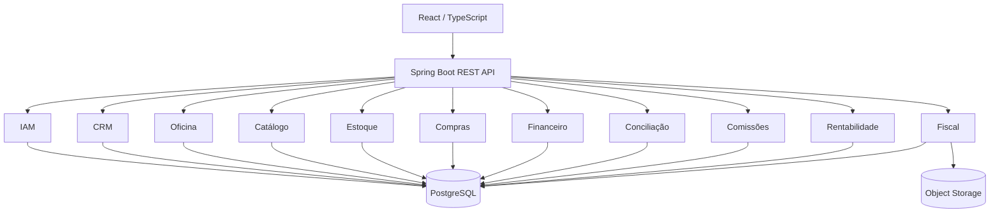
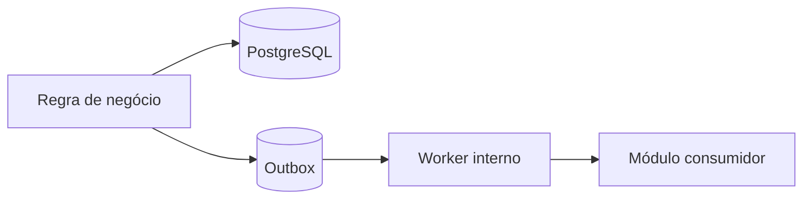
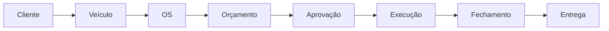
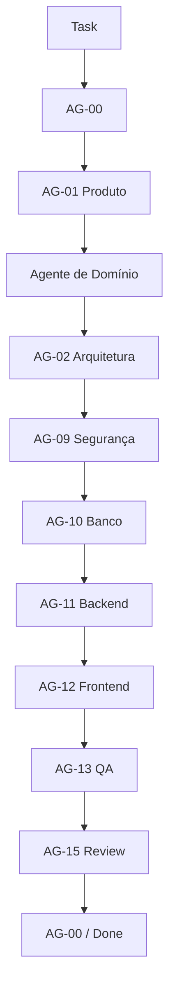

# Uber-Hidráulica ERP

ERP em desenvolvimento para digitalizar e integrar a operação da Uber-Hidráulica, centralizando oficina, clientes, veículos, catálogo, estoque, compras, financeiro, comissões, conciliação, fiscal e rentabilidade.

> O projeto está atualmente na fase de especificação e fundação técnica. A primeira simulação completa de governança, `TASK-0001 — Aprovação Parcial de Orçamento`, foi concluída. Backend Spring Boot, frontend React, migrations e testes executáveis ainda não foram iniciados.

---

## Objetivo

O sistema pretende substituir controles fragmentados por uma plataforma capaz de responder, com rastreabilidade:

```text
Qual serviço foi realizado?

Quem executou?

Quais peças foram utilizadas?

Quanto custou?

Quanto foi cobrado?

Quanto ainda falta receber?

Quanto foi pago ao fornecedor?

Qual foi a comissão do técnico?

Qual foi o lucro real da OS?

Qual condição comercial o cliente efetivamente aprovou?
```

Princípios centrais:

```text
Integridade antes de conveniência.

Histórico antes de sobrescrita.

Backend como fonte de verdade.

Dinheiro sempre com precisão decimal.

Estoque nunca negativo.

Compra não é pagamento.

Recebimento físico não é liquidação financeira.

Movimentação bancária não é despesa automaticamente.

Aprovação pertence à versão comercial apresentada.

Integrações externas não contaminam o domínio.

Módulos não acessam repositories internos de outros módulos.
```

---

# Escopo Inicial

O sistema será inicialmente utilizado por uma única oficina.

Perfis internos previstos:

```text
Dono

Gerente Administrativo

Gerente Financeiro
```

Mecânicos serão inicialmente entidades operacionais, sem necessidade de autenticação própria.

Cliente externo não terá conta no ERP.

---

# Principais Módulos

```text
IAM / Segurança
├── usuários
├── perfis
├── permissões
├── exceções por usuário
└── auditoria

CRM
├── clientes PF/PJ
└── veículos

Oficina
├── ordem de serviço
├── orçamento
├── aprovação do cliente
├── execução
├── garantia
└── workflow

Catálogo
├── serviços
├── peças
├── insumos
├── componentes
├── kits
├── aplicações em veículos
└── grupos de veículos

Estoque
├── físico
├── reservado
├── disponível
├── custo médio
├── inventário
├── ajustes
└── perdas

Compras
├── fornecedores
├── necessidades
├── cotações
├── pedidos
├── recebimentos
├── documentos fiscais
├── obrigações
└── devoluções

Financeiro
├── contas a pagar
├── contas a receber
├── caixa
├── cartões
├── despesas
├── transferências
└── fluxo de caixa

Comissões
├── técnicos
├── níveis
├── cálculo
├── ajustes
└── fechamento

Conciliação
├── Itaú
├── Rede
├── OFX
└── CSV

Rentabilidade / Precificação
├── custo por OS
├── custo por serviço
├── lucro de fechamento
├── lucro real atualizado
├── margem
└── precificação

Fiscal
├── NFS-e
├── DPS
├── PDF/XML
└── histórico fiscal

Integrações
├── Itaú
├── Rede
└── NFS-e
```

---

# Stack Planejada

## Backend

```text
Java

Spring Boot

Spring Modulith

Spring Security

Spring Data JPA

Bean Validation

Flyway

PostgreSQL

OpenAPI

JUnit

Mockito

Testcontainers
```

---

## Frontend

```text
React

TypeScript

React Router

TanStack Query

React Hook Form

Zod
```

---

## Infraestrutura

```text
Docker

PostgreSQL

Object Storage S3-compatible

Cloud-first
```

Ambientes:

```text
DEV

HOMOLOG

PROD
```

Não está previsto para o MVP:

```text
Kubernetes

Kafka

RabbitMQ
```

---

# Arquitetura

A arquitetura inicial é:

```text
MODULAR MONOLITH
```

com:

```text
Spring Modulith
```

Não serão criados microservices prematuramente.



---

# Arquitetura Interna do Backend

Fluxo:

```text
Controller
↓
Application / Use Case
↓
Domain
↓
Repository Port
↓
Persistence Adapter
```

Regras de negócio não devem ser concentradas em:

```text
Controller;

Frontend;

JpaRepository.
```

---

# Fronteiras Entre Módulos

Cada módulo é responsável por:

```text
seus dados;

suas regras;

suas entidades;

seus repositories.
```

Exemplo:

```text
Estoque
```

não acessa diretamente:

```text
QuoteRepository
```

do módulo Oficina.

Comunicação intermodular ocorrerá por:

```text
Application Contracts;

interfaces públicas;

Domain Events;

Integration Events.
```

---

# Transactional Outbox

Eventos importantes deverão utilizar:

```text
Transactional Outbox
```

Fluxo conceitual:



No MVP:

```text
sem Kafka;
sem RabbitMQ.
```

---

# Ordem de Serviço

A OS é criada na entrada do veículo.



---

# Aprovação Parcial de Orçamento

O sistema permite estados simultâneos:

```text
Item A → APROVADO

Item B → REJEITADO

Item C → PENDENTE_APROVACAO
```

Um item aprovado pode seguir para execução permitida sem aguardar todos os demais.

Alterações comerciais em:

```text
preço;

descrição;

quantidade
```

exigem nova versão e nova aprovação.

Alterações internas como:

```text
técnico;

fornecedor;

custo
```

não invalidam automaticamente a decisão comercial.

---

## Versionamento Comercial

O sistema diferencia:

```text
QuoteRevision
```

de:

```text
QuoteItemRevision.
```

Uma revisão global pode reutilizar uma versão comercial existente.

---

## DR-0001

A primeira Decision Request formal do projeto definiu:

```text
DR-0001
Momento de obsolescência de versão comercial pendente
```

Decisão:

```text
OPÇÃO B
```

Regra:

```text
Nova ItemRevision em DRAFT
não invalida a versão apresentada.

Nova ItemRevision do mesmo item,
quando PRESENTED,
faz a versão anterior deixar de aceitar novas decisões.

Uma revisão de complemento reutilizando
a mesma ItemRevision não invalida essa versão.
```

---

# Aprovação Pública

O cliente não possui conta interna.

O orçamento poderá ser decidido através de:

```text
link público seguro.
```

A decisão registra:

```text
nome;

CPF/CNPJ;

aceite explícito;

data/hora do servidor;

IP;

User-Agent;

revisão;

versões dos itens;

decisões.
```

---

## Segurança do Token

Planejamento:

```text
token opaco;

alta entropia;

SecureRandom;

256 bits recomendados;

URL-safe.
```

O token bruto:

```text
não será persistido.
```

Persistência:

```text
SHA-256 digest.
```

---

# Estoque

O estoque diferencia:

```text
FÍSICO

RESERVADO

DISPONÍVEL
```

Regra:

```text
disponível = físico - reservado
```

Não será permitido:

```text
estoque negativo.
```

---

# Custos

Método principal:

```text
custo médio ponderado.
```

Compra específica de uma OS poderá utilizar seu custo real específico para rentabilidade daquela operação.

---

# Comissão dos Técnicos

A comissão utiliza:

```text
valor-base do serviço
```

e não necessariamente o preço final cobrado do cliente.

Pool máximo:

```text
30%
```

Exemplo:

```text
Base = R$ 350

N5 = peso 30
N2 = peso 10

Pool = R$ 105

N5:
30 / 40 × 105
= R$ 78,75

N2:
10 / 40 × 105
= R$ 26,25
```

---

# Financeiro

O sistema separa:

```text
COMPETÊNCIA

FLUXO DE CAIXA

CONCILIAÇÃO
```

Compra de:

```text
R$ 1.200
```

paga em:

```text
3 × R$ 400
```

possui:

```text
efeito econômico:
R$ 1.200

efeito de caixa:
R$ 400 por parcela.
```

---

# Rentabilidade

Cada OS deverá permitir analisar:

```text
Lucro no fechamento

Lucro real atualizado

Margem no fechamento

Margem real atualizada
```

O fechamento histórico não é sobrescrito por ajustes posteriores.

---

# Integrações

## Itaú

```text
movimentações;

classificação;

conciliação.
```

## Rede

```text
transações;

taxas;

liquidações.
```

## NFS-e

Município inicial:

```text
Uberlândia / MG
```

Responsabilidades:

```text
emissão;

consulta;

cancelamento;

PDF/XML;

histórico.
```

Integrações serão isoladas através de:

```text
ports;
adapters.
```

---

# Segurança Interna

Planejamento:

```text
Spring Security

Session-based Authentication

Secure HttpOnly Cookie
```

Perfis iniciais:

```text
Dono

Gerente Administrativo

Gerente Financeiro
```

Permissões serão configuráveis.

Exceções por usuário também serão permitidas.

Ações críticas poderão exigir segunda autorização do Dono através da própria sessão autenticada.

Não será utilizada:

```text
senha mestre compartilhada.
```

---

# Governança por Agentes

O projeto possui 16 agentes documentados:

```text
AG-00 — Orquestrador

AG-01 — Produto & Requisitos

AG-02 — Arquitetura

AG-03 — Domínio Oficina

AG-04 — Catálogo & Estoque

AG-05 — Compras & Fornecedores

AG-06 — Financeiro, Comissão & Rentabilidade

AG-07 — Conciliação & Integrações Financeiras

AG-08 — Fiscal

AG-09 — Segurança & Auditoria

AG-10 — Banco de Dados

AG-11 — Backend Spring

AG-12 — Frontend React

AG-13 — QA & Testes

AG-14 — DevOps

AG-15 — Revisor Técnico
```

Entrada da governança:

```text
AGENTS.md
```

Especificações:

```text
agents/
```

---

# Fluxo de Desenvolvimento

Fluxo de referência:



AG-09 entra conforme risco da feature.

AG-14 entra quando houver:

```text
infraestrutura;

deploy;

CI/CD;

segredos;

proxy;

HTTPS;

observabilidade.
```

Ambiguidades relevantes utilizam:

```text
Decision Request.
```

---

# Estrutura Atual do Repositório

```text
uberhidraulica-erp/
│
├── agents/
│   ├── AG-00-orquestrador.md
│   ├── AG-01-produto-requisitos.md
│   ├── AG-02-arquitetura.md
│   ├── AG-03-dominio-oficina.md
│   ├── AG-04-catalogo-estoque.md
│   ├── AG-05-compras-fornecedores.md
│   ├── AG-06-financeiro.md
│   ├── AG-07-conciliacao-integracoes-financeiras.md
│   ├── AG-08-fiscal.md
│   ├── AG-09-seguranca-auditoria.md
│   ├── AG-10-banco-dados.md
│   ├── AG-11-backend-spring.md
│   ├── AG-12-frontend-react.md
│   ├── AG-13-qa-testes.md
│   ├── AG-14-devops.md
│   └── AG-15-revisor-tecnico.md
│
├── decision-requests/
│   ├── DECISION-REQUEST-TEMPLATE.md
│   └── DR-0001-obsolescencia-versao-comercial.md
│
├── docs/
│   ├── api/
│   ├── architecture/
│   │   ├── database/
│   │   ├── frontend/
│   │   ├── governance/
│   │   ├── oficina/
│   │   ├── security/
│   │   └── testing/
│   ├── domain/
│   │   └── oficina/
│   ├── requirements/
│   │   └── oficina/
│   └── review/
│
├── tasks/
│   ├── done/
│   │   └── TASK-0001-aprovacao-parcial-orcamento.md
│   ├── HANDOFF-TEMPLATE.md
│   └── TASK-TEMPLATE.md
│
├── AGENTS.md
├── README.md
└── .gitignore
```

---

# Estado Atual

```text
[✓] Requisitos iniciais levantados

[✓] Arquitetura macro definida

[✓] Governança definida

[✓] 16 agentes documentados

[✓] Tasks e handoffs estruturados

[✓] Decision Requests estruturadas

[✓] Repositório Git/GitHub configurado

[✓] Simulação completa do fluxo de governança

[✓] TASK-0001 especificada

[✓] DR-0001 decidida

[✓] Review independente da TASK-0001

[✓] Correções da TASK-0001

[✓] Re-review AG-15

[✓] TASK-0001 = SPECIFICATION_DONE

[ ] Projeto Spring Boot

[ ] PostgreSQL executável / Flyway

[ ] Frontend React

[ ] Testes automatizados

[ ] Integrações externas

[ ] Deploy
```

---

# TASK-0001

Primeira feature utilizada para validar todo o processo:

```text
TASK-0001
Aprovação Parcial de Orçamento
```

Status:

```text
SPECIFICATION_DONE
```

Implementação:

```text
NOT_IMPLEMENTED
```

Fluxo validado:

```text
Produto
↓
Domínio
↓
Arquitetura
↓
Segurança
↓
Banco
↓
Backend
↓
Frontend
↓
QA
↓
AG-15
↓
Decision Request
↓
Correção
↓
Re-review
↓
AG-00
```

---

# Próxima Fase

A próxima etapa é iniciar a fundação executável do sistema.

Sequência planejada:

```text
Spring Boot base
↓
PostgreSQL / Flyway
↓
IAM
↓
Cliente
↓
Veículo
↓
OS
↓
Catálogo de Serviços
↓
Peças
↓
Orçamento
↓
Aprovação
```

A primeira vertical slice funcional completa planejada é:

```text
Cliente
↓
Veículo
↓
OS
↓
Serviço
↓
Peças
↓
Técnicos
↓
Orçamento
↓
Aprovação
↓
Execução
↓
Fechamento
↓
Custo
↓
Lucro
```

---

# Estado de Produção

Atualmente o projeto possui:

```text
ESPECIFICAÇÃO
```

e não:

```text
SISTEMA EM PRODUÇÃO.
```

Ainda faltam:

```text
código;

migrations;

testes;

CI;

infraestrutura;

deploy;

validação operacional.
```

---

# Repositório

Projeto:

```text
Wendersonjose/uberhidraulica-erp
```

Branch principal:

```text
main
```

---

# Regra Final do Projeto

```text
ENTENDER
ANTES DE IMPLEMENTAR.

PRESERVAR
ANTES DE SOBRESCREVER.

VALIDAR
ANTES DE CONFIAR.

MEDIR
ANTES DE DECIDIR.
```