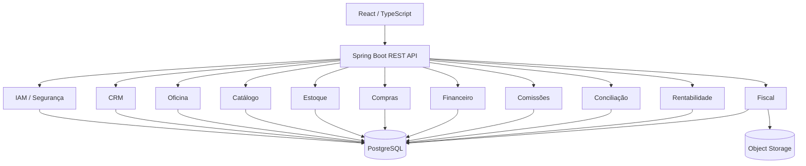
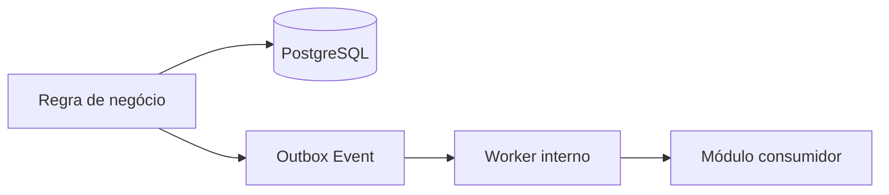
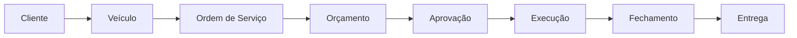
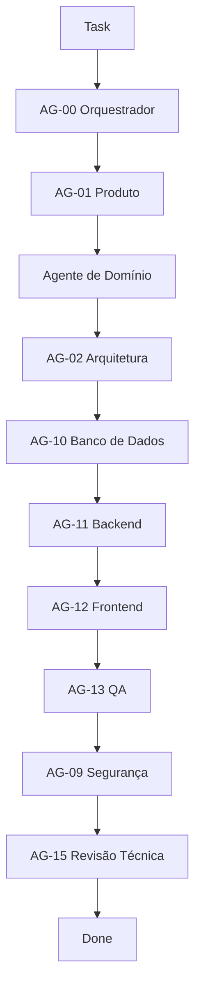

# Uber-Hidráulica ERP

ERP desenvolvido para digitalizar e integrar a operação de uma oficina mecânica especializada, centralizando processos de oficina, clientes, veículos, estoque, compras, financeiro, comissões, conciliação, fiscal e rentabilidade.

> Projeto em desenvolvimento. Atualmente estamos na fase de especificação funcional, arquitetura e validação de domínio antes do início da implementação do backend e frontend.

---

## Objetivo

O objetivo do projeto é substituir controles fragmentados por um sistema integrado capaz de responder, com rastreabilidade:

```text
Qual serviço foi realizado?
Quem executou?
Quais peças foram utilizadas?
Quanto custou?
Quanto foi cobrado?
Quanto ainda falta receber?
Quanto foi pago ao fornecedor?
Qual foi a comissão do técnico?
Qual foi o lucro real da OS?
```

O sistema foi projetado para preservar histórico, evitar duplicidades e separar corretamente conceitos operacionais, financeiros e fiscais.

---

## Principais módulos

O ERP será dividido em módulos de domínio bem definidos:

```text
IAM / Segurança
├── usuários
├── perfis
├── permissões
└── auditoria

CRM
├── clientes
└── veículos

Oficina
├── ordem de serviço
├── orçamento
├── aprovação do cliente
├── execução
├── garantia
└── workflow

Catálogo
├── serviços
├── peças
├── componentes
├── aplicações
└── grupos de veículos

Estoque
├── saldo físico
├── saldo reservado
├── saldo disponível
├── inventário
├── perdas
└── custo médio

Compras
├── fornecedores
├── necessidades de compra
├── cotações
├── pedidos
├── recebimentos
└── devoluções

Financeiro
├── contas a pagar
├── contas a receber
├── caixa
├── cartões
├── despesas
├── transferências
└── fluxo de caixa

Comissões
├── técnicos
├── níveis
├── cálculo
└── fechamento

Conciliação
├── Itaú
├── Rede
├── OFX
└── CSV

Rentabilidade
├── custo da OS
├── lucro de fechamento
├── lucro real atualizado
└── precificação

Fiscal
└── NFS-e
```

---

## Stack planejada

### Backend

```text
Java
Spring Boot
Spring Modulith
Spring Security
Spring Data JPA
Bean Validation
Flyway
PostgreSQL
OpenAPI
JUnit
Mockito
Testcontainers
```

### Frontend

```text
React
TypeScript
React Router
TanStack Query
React Hook Form
Zod
```

### Infraestrutura

```text
Docker
PostgreSQL
Object Storage S3-compatible
Cloud-first
```

Ambientes previstos:

```text
DEV
HOMOLOG
PROD
```

---

## Arquitetura

O sistema será desenvolvido inicialmente como um:

```text
MODULAR MONOLITH
```

e não como microservices.

A aplicação terá um único deploy principal, mas com fronteiras internas explícitas entre módulos.



---

## Arquitetura interna do backend

O fluxo principal será:

```text
Controller
↓
Application Service / Use Case
↓
Domain
↓
Repository Port
↓
Persistence Adapter
```

Regras de negócio não devem ficar em:

```text
Controller
Frontend
Repository
```

O backend será a fonte de verdade das regras de negócio.

---

## Fronteiras entre módulos

Cada módulo será responsável por seus próprios dados e regras.

Exemplo:

```text
Estoque
```

não deve acessar diretamente:

```text
QuoteRepository
```

do módulo Oficina.

A comunicação deverá acontecer através de:

```text
Application Contracts
Domain Events
Integration Events
```

---

## Eventos de domínio

O projeto utilizará eventos para reduzir acoplamento entre módulos.

Exemplos:

```text
WorkOrderOpened
QuoteSent
QuoteItemApproved
QuoteItemRejected
PartReserved
PurchaseNeedCreated
PartReceived
PartApplied
ServiceStarted
ServiceCompleted
CommissionEligible
WorkOrderClosed
VehicleDelivered
PaymentRegistered
PaymentReconciled
WarrantyOpened
NfseRequested
NfseIssued
NfseFailed
```

---

## Transactional Outbox

Eventos importantes que precisam sobreviver a falhas utilizarão:

```text
Transactional Outbox
```

Fluxo conceitual:



No MVP não serão utilizados:

```text
Kafka
RabbitMQ
```

---

## Ordem de Serviço

A OS é criada quando o veículo entra na oficina.

O orçamento acontece dentro da OS.

Fluxo conceitual:



---

## Aprovação parcial de orçamento

O sistema foi projetado para permitir aprovação individual dos itens.

Exemplo:

```text
Item A → APROVADO
Item B → REJEITADO
Item C → PENDENTE_APROVACAO
```

O item aprovado pode seguir para execução sem depender dos demais.

Alterações em:

```text
preço
descrição
quantidade
```

exigem nova aprovação.

Alterações internas, como:

```text
técnico
fornecedor
custo
```

não invalidam automaticamente a aprovação do cliente.

---

## Estoque

O estoque diferencia:

```text
FÍSICO
RESERVADO
DISPONÍVEL
```

Regra:

```text
disponível = físico - reservado
```

O sistema não permitirá estoque negativo.

---

## Custos

O estoque utilizará:

```text
custo médio ponderado
```

Compras específicas para uma OS poderão preservar custo específico para cálculo de rentabilidade.

---

## Rentabilidade da OS

Um dos principais objetivos do ERP é medir o resultado real de cada Ordem de Serviço.

Cada OS deverá possuir pelo menos:

```text
Lucro no fechamento
Lucro real atualizado
Margem no fechamento
Margem real atualizada
```

O resultado histórico de fechamento será preservado.

Ajustes posteriores poderão alterar apenas o resultado real atualizado.

---

## Comissão dos técnicos

A comissão será calculada sobre o:

```text
valor-base do serviço
```

e não necessariamente sobre o preço final cobrado do cliente.

Pool máximo:

```text
30%
```

Exemplo:

```text
Base do serviço = R$ 350

Técnico N5 = peso 30
Técnico N2 = peso 10

Pool máximo = R$ 105

N5:
30 / 40 × 105
= R$ 78,75

N2:
10 / 40 × 105
= R$ 26,25
```

---

## Regime econômico e financeiro

O sistema separará três conceitos:

```text
COMPETÊNCIA
FLUXO DE CAIXA
CONCILIAÇÃO
```

Exemplo:

```text
Compra:
R$ 1.200

Pagamento:
3 × R$ 400
```

Resultado econômico:

```text
R$ 1.200
```

Fluxo de caixa:

```text
Mês 1 → R$ 400
Mês 2 → R$ 400
Mês 3 → R$ 400
```

---

## Integrações previstas

### Itaú

Objetivo:

```text
movimentações bancárias
conciliação
classificação
```

### Rede

Objetivo:

```text
transações de cartão
taxas
liquidações
```

### NFS-e

Objetivo:

```text
emissão
consulta
cancelamento
armazenamento de PDF/XML
```

Município inicial:

```text
Uberlândia / MG
```

As integrações serão isoladas através de adapters.

---

## Segurança

O sistema deverá utilizar:

```text
Spring Security
Secure HttpOnly Cookies
Session-based Authentication
```

Permissões serão configuráveis por perfil e poderão possuir exceções por usuário.

Perfis iniciais:

```text
Dono
Gerente Administrativo
Gerente Financeiro
```

Ações críticas poderão exigir aprovação adicional do Dono através da própria sessão autenticada.

Não será utilizada senha mestre compartilhada.

---

## Aprovação pública do cliente

O cliente não precisa possuir conta no ERP.

Orçamentos poderão ser aprovados através de link público seguro.

A decisão deve registrar evidências como:

```text
nome
CPF/CNPJ
aceite explícito
data/hora
IP
user-agent
revisão apresentada
itens decididos
```

---

## Governança por agentes

Antes da implementação do sistema foi definida uma estrutura de agentes especializados.

```text
AG-00 — Orquestrador
AG-01 — Produto & Requisitos
AG-02 — Arquitetura
AG-03 — Domínio Oficina
AG-04 — Catálogo & Estoque
AG-05 — Compras & Fornecedores
AG-06 — Financeiro, Comissão & Rentabilidade
AG-07 — Conciliação & Integrações Financeiras
AG-08 — Fiscal
AG-09 — Segurança & Auditoria
AG-10 — Banco de Dados
AG-11 — Backend Spring
AG-12 — Frontend React
AG-13 — QA & Testes
AG-14 — DevOps
AG-15 — Revisor Técnico
```

Os agentes possuem responsabilidades e limites documentados dentro da pasta:

```text
agents/
```

---

## Fluxo de desenvolvimento

Uma feature passa pelo seguinte processo:



Quando existe ambiguidade relevante:

```text
Decision Request
```

é criado antes de prosseguir.

---

## Estrutura atual do repositório

```text
uberhidraulica-erp/
│
├── agents/
│   ├── AG-00-orquestrador.md
│   ├── AG-01-produto-requisitos.md
│   ├── AG-02-arquitetura.md
│   ├── AG-03-dominio-oficina.md
│   ├── AG-04-catalogo-estoque.md
│   ├── AG-05-compras-fornecedores.md
│   ├── AG-06-financeiro.md
│   ├── AG-07-conciliacao-integracoes-financeiras.md
│   ├── AG-08-fiscal.md
│   ├── AG-09-seguranca-auditoria.md
│   ├── AG-10-banco-dados.md
│   ├── AG-11-backend-spring.md
│   ├── AG-12-frontend-react.md
│   ├── AG-13-qa-testes.md
│   ├── AG-14-devops.md
│   └── AG-15-revisor-tecnico.md
│
├── decision-requests/
│
├── docs/
│   ├── api/
│   ├── architecture/
│   ├── decisions/
│   ├── domain/
│   └── requirements/
│
├── tasks/
│   ├── backlog/
│   ├── in-progress/
│   ├── review/
│   └── done/
│
├── AGENTS.md
├── .gitignore
└── README.md
```

---

## Estado atual do projeto

Atualmente:

```text
[✓] Requisitos iniciais levantados
[✓] Arquitetura macro definida
[✓] Governança definida
[✓] 16 agentes documentados
[✓] Estrutura de Tasks criada
[✓] Estrutura de Decision Requests criada
[✓] Repositório Git configurado
[✓] Repositório GitHub criado

[~] Simulação do fluxo de desenvolvimento
[~] Especificação da aprovação parcial de orçamento

[ ] Projeto Spring Boot
[ ] Banco PostgreSQL
[ ] Frontend React
[ ] Testes automatizados
[ ] Integrações externas
[ ] Deploy
```

---

## Primeira feature utilizada para validar a arquitetura

```text
TASK-0001
Aprovação Parcial de Orçamento
```

Essa feature está sendo utilizada para validar o processo:

```text
Requisito
↓
Domínio
↓
Arquitetura
↓
Segurança
↓
Banco
↓
Backend
↓
Frontend
↓
QA
↓
Revisão
```

antes de iniciar a implementação de produção.

---

## Estratégia de implementação

A primeira vertical slice planejada é:

```text
Cliente
↓
Veículo
↓
OS
↓
Serviço
↓
Peças
↓
Técnicos
↓
Orçamento
↓
Aprovação
↓
Execução
↓
Fechamento
↓
Custo
↓
Lucro da OS
```

---

## Princípios do projeto

```text
Integridade antes de conveniência.

Histórico antes de sobrescrita.

Backend como fonte de verdade.

Dinheiro sempre com precisão decimal.

Estoque nunca negativo.

Compra não é pagamento.

Recebimento não é compra.

Movimentação bancária não é despesa automaticamente.

Aprovação do cliente é vinculada à versão apresentada.

Integrações externas não devem contaminar o domínio.

Nenhum módulo acessa diretamente repositories de outro módulo.
```

---

## Roadmap macro

### Fase 1 — Fundação

```text
IAM
Usuários
Permissões
Auditoria
```

### Fase 2 — Operação básica

```text
Clientes
Veículos
Serviços
Peças
OS
Orçamento
Aprovação
```

### Fase 3 — Operação avançada

```text
Estoque
Reservas
Técnicos
Comissões
Compras
Fornecedores
```

### Fase 4 — Financeiro

```text
Contas a pagar
Contas a receber
Caixa
Cartões
Despesas
```

### Fase 5 — Gestão

```text
Conciliação
Rentabilidade
Garantia
Precificação
```

### Fase 6 — Integrações

```text
NFS-e
Itaú
Rede
```

### Fase 7 — Automação

```text
Workflow configurável
Dashboard
```

---

## Desenvolvimento

O projeto ainda não entrou na implementação de produção.

Quando a base Spring Boot for criada, esta seção será atualizada com:

```text
pré-requisitos
setup local
variáveis de ambiente
Docker
PostgreSQL
execução do backend
execução do frontend
testes
```

---

## Segurança do repositório

Nunca versionar:

```text
.env
senhas
API keys
tokens
certificados
arquivos .pfx
arquivos .p12
client secrets
credenciais bancárias
credenciais fiscais
```

Esses arquivos já devem ser cobertos pelo `.gitignore` e serão tratados através de configuração segura.

---

## Status

```text
🚧 Em desenvolvimento
```

Projeto atualmente focado em:

```text
Domain Modeling
Software Architecture
Requirements Engineering
Modular Monolith
ERP Development
```

---

## Autor

Projeto desenvolvido para a operação da Uber-Hidráulica.

Repositório:

```text
Wendersonjose/uberhidraulica-erp
```

---

## Licença

A licença do projeto ainda não foi definida.

Até que exista um arquivo `LICENSE`, nenhum modelo de licença deve ser presumido.