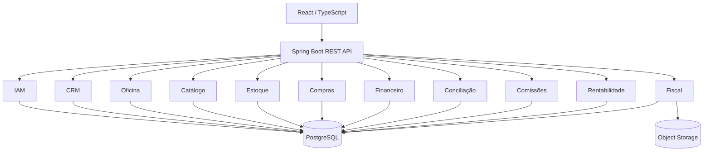
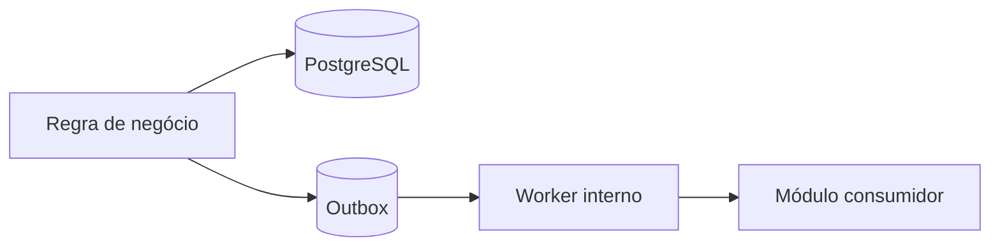
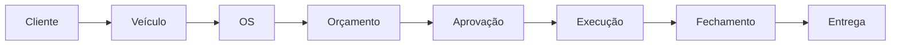
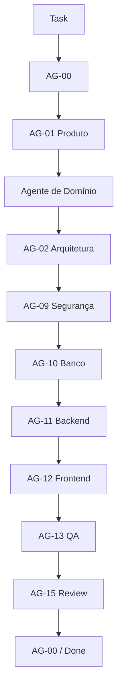

# Uber-Hidráulica ERP

ERP em desenvolvimento para digitalizar e integrar a operação da Uber-Hidráulica, centralizando oficina, clientes, veículos, catálogo, estoque, compras, financeiro, comissões, conciliação, fiscal e rentabilidade.

> **Estado em 2026-10-05 — `READY_FOR_HOMOLOGATION` (piloto de uma oficina). Não é `READY_FOR_PRODUCTION`.**
>
> O sistema executável cobre o ciclo da oficina de ponta a ponta — cliente, veículo, serviço, peça, estoque, OS,
> diagnóstico, orçamento versionado com aprovação parcial pelo cliente (link público), execução, faturamento,
> recebimento, caixa físico, contas a pagar, fluxo de caixa e painel financeiro — com backend Spring Boot,
> PostgreSQL, frontend React e deploy por Docker Compose. O que ainda **não** existe (Compras, Comissões,
> Conciliação, Fiscal/NFS-e) está listado em [Funcionalidades pendentes](#funcionalidades-pendentes) e não deve ser
> assumido como pronto.
>
> **Produção ainda não está declarada.** O HTTPS (Caddy + Let's Encrypt, ou o balanceador do provedor), o proxy
> confiável, o backup, o restore, a atualização e o rollback foram exercitados com containers reais, mas faltam as provas
> que só um servidor real e o proprietário dão: certificado emitido, backup copiado para fora do servidor e restaurado,
> homologação operacional, CI verde e a decisão da `DR-0020`. A lista exata (bloqueadores, pendências de homologação e
> pós-MVP) está em [`docs/review/RELEASE-producao.md`](docs/review/RELEASE-producao.md). O estado só vira
> `READY_FOR_PRODUCTION` quando cada bloqueador de lá tiver evidência.
>
> Detalhes das auditorias: [`TASK-0019`](docs/review/TASK-0019-revisao-fechamento.md) (fechamento do MVP) e
> [`TASK-0020`](docs/review/RELEASE-producao.md) (preparação para produção).

---

# Estado atual

Legenda: **Entregue** · **Parcial** (existe, com lacuna declarada) · **Planejado** (especificado, sem código) ·
**Fora do MVP** (decisão de escopo) · **Bloqueado** (depende de decisão ou de item externo).

## Funcionalidades entregues

| Área | Status | O que existe | Task |
| --- | --- | --- | --- |
| IAM / Segurança | Entregue | login por sessão (cookie `HttpOnly`, `SameSite=Lax`, `Secure` em produção), CSRF, bootstrap do Dono, troca obrigatória de senha, perfis fixos (Dono, Gerente Administrativo, Gerente Financeiro), permissões com exceções por usuário (`ALLOW`/`DENY`/`INHERIT`), uma sessão por usuário, auditoria | 0003, 0017 |
| Administração de usuários | Entregue | criar usuário com senha temporária (exibida uma vez), ativar/inativar, redefinir senha, exceções de permissão (tela `/configuracoes/usuarios`) | 0003, 0018 |
| Clientes e veículos | Entregue | cliente PF/PJ, veículo, busca, inativação, transferência de propriedade e histórico | 0009, 0010 |
| Catálogo de serviços | Entregue | serviços, categorias, grupos de veículos, preço por veículo/grupo e sugestão de preço | 0011 |
| Catálogo de peças e produtos | Parcial | cadastro com tipo, unidade (inclusive galão/balde), custo de referência e preço; **composição de kits/componentes e aplicações por veículo não existem** | 0005 |
| Ordem de Serviço | Entregue | abertura, serviços e peças com snapshot de preço, diagnóstico, status configuráveis, Kanban, automações, histórico, cancelamento | 0004, 0006, 0012 |
| Orçamento | Entregue | revisões com versionamento comercial, apresentação, validade de 7 dias, obsolescência derivada, desconto, decisão interna | 0007, 0013 |
| Aprovação do cliente | Entregue | link público com token de 256 bits (somente o SHA-256 é guardado), decisão parcial item a item, evidências (nome, documento, aceite, IP, User-Agent), idempotência e atomicidade | 0001 → 0008 |
| Estoque | Parcial | saldo físico, entrada, saída, ajuste, estorno, custo médio ponderado, baixa configurável pela OS, devolução no cancelamento; **reserva, inventário e perdas não existem** | 0014 |
| Financeiro | Entregue | recebíveis por OS (só o que o cliente aprovou), recebimento parcial/total com idempotência, ajustes, estorno, contas a pagar, formas de pagamento, categorias, fluxo de caixa | 0015 |
| Caixa físico | Entregue | sessão de caixa, suprimento, sangria, troco, estorno, fechamento manual/automático às 23:59, conferência | 0016 |
| Painel financeiro | Parcial | faturamento, recebido, a receber, vencido, custo de peças, despesas, lucro e margem **bruta/operacional**; não é DRE e não custeia mão de obra | 0018 |
| Deploy e operação do piloto | Parcial | `docker compose up -d --build` (Postgres 18 + backend + nginx), HTTPS turnkey com Caddy (`compose.https.yaml`), proxy confiável (`TRUSTED_PROXY_CIDRS`), produção que falha fechada, scripts `scripts/ops` (preflight, backup, verificação, restore, update), CI com smoke de deploy e varredura de dependências; **falta provar em servidor real: certificado, backup externo, homologação** | 0018, 0019, 0020 |

## Funcionalidades pendentes

| Área | Status | Situação |
| --- | --- | --- |
| Compras e Fornecedores | Planejado / Bloqueado | especificado em `agents/AG-05`; sem Task nem Decision Request — ver [DR-0021](decision-requests/DR-0021-escopo-piloto-modulos-especificados.md) |
| Comissões | Planejado / Bloqueado | regra descrita no README e em `AG-06`; exige confirmar as regras — DR-0021 |
| Conciliação bancária (Itaú, Rede, OFX, CSV) | Planejado / Bloqueado | exige layouts reais e credenciais — DR-0021 |
| Fiscal / NFS-e (Uberlândia/MG) | Planejado / Bloqueado | exige certificado A1, API municipal e ambiente de homologação fiscal (todos externos) — DR-0021 |
| Rentabilidade avançada e precificação | Planejado | só existe o painel gerencial; custo de mão de obra não definido |
| Garantia avançada | Parcial | os dias de garantia do serviço ficam registrados na OS; validade e acionamento não existem |
| Transactional Outbox | Planejado | os eventos entre módulos hoje são eventos Spring na mesma transação (suficiente para um monólito); o outbox só será necessário com integrações externas |
| OpenAPI | Planejado | os contratos REST ficam em `docs/api`; não há especificação OpenAPI gerada |
| Segunda autorização do Dono em ações críticas | Planejado | descrita nos requisitos, sem implementação |
| Multi-tenant / SaaS | Fora do MVP | o piloto atende uma oficina (decisão da TASK-0018) |
| WhatsApp, folha de pagamento, férias, 13º, rescisões, estoque máximo, lote/validade, mobile completo, offline | Fora do MVP | `agents/AG-00`, seção 24 |

## Decisões pendentes do proprietário

| DR | Assunto | Impede a homologação? |
| --- | --- | --- |
| [DR-0019](decision-requests/DR-0019-item-fisico-rejeitado-estoque-custo.md) | item físico rejeitado pelo cliente: o que acontece com o estoque e o custo | Não (limitação conhecida do piloto; contorno: estornar a baixa; não bloqueia a produção se o proprietário aceitar o processo) |
| [DR-0020](decision-requests/DR-0020-politica-autenticacao-bloqueio-delegacao.md) | bloqueio por tentativas de login, política de senha avançada, delegação do perfil Dono (resumo com opções, impacto e recomendação na seção 9) | Não impede a homologação; **o proprietário decide ou aceita o risco antes da produção**. Enquanto isso, não delegue `IAM_*` (o preflight confere) |
| [DR-0021](decision-requests/DR-0021-escopo-piloto-modulos-especificados.md) | o que "MVP concluído" significa e a ordem dos módulos pendentes | Não |

## Como executar (desenvolvimento)

Requisitos: JDK 17+, Maven, Node 22+, Docker (para o PostgreSQL local e para os testes de integração).

```bash
docker compose -f compose.dev.yaml up -d      # PostgreSQL 18 só para desenvolvimento (127.0.0.1:5432)
mvn spring-boot:run                           # backend em :8080; Flyway cria o schema inteiro
cd frontend && npm ci && npm run dev          # frontend em :5173, com proxy de /api para :8080
```

O primeiro Dono é criado pelo bootstrap (só quando não há nenhum usuário): exporte
`IAM_BOOTSTRAP_OWNER_NAME`, `IAM_BOOTSTRAP_OWNER_EMAIL` e `IAM_BOOTSTRAP_OWNER_PASSWORD` (8 a 72 caracteres) antes de
subir o backend; o primeiro login exige trocar a senha.

## Como testar

```bash
mvn clean test                                # backend: unitários + Modulith + integração com PostgreSQL 18 real (Testcontainers; exige Docker)
cd frontend && npm ci
npm test -- --run && npx tsc --noEmit && npm run lint && npm run build
python3 scripts/e2e/workshop_flow.py          # fluxo E2E da oficina por HTTP (ver o cabeçalho do arquivo para as variáveis)
scripts/deploy/compose-smoke.sh               # stack do piloto com Docker: E2E, reinício, backup/restore, troca HTTP→HTTPS
scripts/deploy/proxy-trust-check.sh <imagem>  # X-Forwarded-For forjado, falha fechada, limite por IP real, token fora do log
```

Números de 2026-10-05 (ver [`docs/review/RELEASE-producao.md`](docs/review/RELEASE-producao.md)): backend 276 testes, 0 falhas
(parte deles sem Docker); frontend 17 arquivos, 137 testes; E2E 107 verificações; navegador (Chromium) 26 passos da jornada
e 18 caminhos negativos; `proxy-trust-check` 37 verificações. O CI (`.github/workflows/backend-ci.yml`) roda a suíte
backend, o frontend, a varredura de dependências, o smoke de deploy (inclui HTTPS e os scripts de operação) e, em PR, a
imutabilidade das migrations.

## Como subir com Docker (piloto)

```bash
cp .env.example .env     # preencha DB_PASSWORD e o bootstrap do Dono (segredos vêm vazios de propósito)
docker compose up -d --build
docker compose ps        # postgres, backend e frontend "healthy"
```

Com HTTPS turnkey (Caddy + Let's Encrypt; defina `SITE_ADDRESS` e `COMPOSE_FILE=compose.yaml:compose.https.yaml` no `.env`):

```bash
docker compose up -d --build
PUBLIC_URL=https://erp.suaoficina.com.br scripts/ops/preflight.sh   # checklist de produção; exit 1 se houver FALHA
scripts/ops/backup.sh                                              # dump validado + cópia para FORA do servidor
scripts/ops/update.sh                                              # git pull antes: backup, build, smoke e histórico para rollback
```

Guia completo — modos de HTTPS, proxy confiável, backup, verificação, restore, atualização, rollback e checklist de
produção: [`docs/architecture/devops/DEPLOY-piloto.md`](docs/architecture/devops/DEPLOY-piloto.md). Homologação em HTTP puro
exige `APP_ENVIRONMENT=homologation` e `SESSION_COOKIE_SECURE=false` (nunca em produção: o backend recusa a combinação).

## Limitações conhecidas

- **HTTPS real ainda não foi provado**: o Caddy (`compose.https.yaml`) e o balanceador do provedor foram exercitados com
  certificado de CA interna e balanceador simulado. Sem um domínio público, o certificado real não foi emitido; sem HTTPS
  não declare produção.
- O backup só protege se for copiado **para fora do servidor** (`BACKUP_EXTERNAL_CMD`); sem isso `backup.sh` termina com
  erro. A restauração a partir da cópia externa real ainda precisa ser ensaiada.
- Orçamento, revisão, apresentação e decisão não são aceitos em OS finalizada, entregue ou cancelada (409).
- Em OS com aprovação parcial, o item físico **rejeitado** continua baixado do estoque e entra no custo de peças do
  painel até o operador estornar a baixa (`DR-0019`). O recebível fatura só o que o cliente aprovou.
- Não há bloqueio de conta por tentativas de login; há limite por IP no nginx e senha mínima de 8 caracteres
  (`DR-0020`). Quem tem `IAM_USERS_MANAGE` pode criar usuário `DONO`: não delegue permissões `IAM_*` a gerentes.
- Todo usuário autenticado consulta (GET) os cadastros e as OS; a escrita e o financeiro são protegidos por permissão.
- O painel financeiro não é DRE e não custeia mão de obra.
- Erros do framework (rota inexistente, método, tipo de conteúdo) saem no formato padrão do Spring, não em
  `{code, message, details}`; o frontend mostra mensagem em português.
- A suíte de integração precisa de Docker; sem ele só rodam os testes unitários e de arquitetura.

## Próximos passos

1. Proprietário decide `DR-0019`, `DR-0020` e `DR-0021`.
2. Homologar com a oficina em um servidor real seguindo o checklist de `DEPLOY-piloto.md` e os bloqueadores B1–B5 de
   `docs/review/RELEASE-producao.md` (HTTPS com certificado real, backup externo restaurado, CI verde).
3. Abrir, pelo fluxo de governança, a Task do próximo módulo definido na `DR-0021` (recomendado: Compras e Fornecedores).
4. Fiscal/NFS-e só depois de haver certificado A1 e ambiente de homologação do município.

---

## Objetivo

O sistema pretende substituir controles fragmentados por uma plataforma capaz de responder, com rastreabilidade:

```text
Qual serviço foi realizado?

Quem executou?

Quais peças foram utilizadas?

Quanto custou?

Quanto foi cobrado?

Quanto ainda falta receber?

Quanto foi pago ao fornecedor?

Qual foi a comissão do técnico?

Qual foi o lucro real da OS?

Qual condição comercial o cliente efetivamente aprovou?
```

Princípios centrais:

```text
Integridade antes de conveniência.

Histórico antes de sobrescrita.

Backend como fonte de verdade.

Dinheiro sempre com precisão decimal.

Estoque nunca negativo.

Compra não é pagamento.

Recebimento físico não é liquidação financeira.

Movimentação bancária não é despesa automaticamente.

Aprovação pertence à versão comercial apresentada.

Integrações externas não contaminam o domínio.

Módulos não acessam repositories internos de outros módulos.
```

---

> As seções abaixo descrevem o **desenho-alvo** e as regras aprovadas do produto, preservadas como decisão histórica.
> O que está efetivamente implementado, e o que não está, é a tabela de [Estado atual](#estado-atual).

# Escopo Inicial

O sistema será inicialmente utilizado por uma única oficina.

Perfis internos previstos:

```text
Dono

Gerente Administrativo

Gerente Financeiro
```

Mecânicos serão inicialmente entidades operacionais, sem necessidade de autenticação própria.

Cliente externo não terá conta no ERP.

---

# Principais Módulos

```text
IAM / Segurança
├── usuários
├── perfis
├── permissões
├── exceções por usuário
└── auditoria

CRM
├── clientes PF/PJ
└── veículos

Oficina
├── ordem de serviço
├── orçamento
├── aprovação do cliente
├── execução
├── garantia
└── workflow

Catálogo
├── serviços
├── peças
├── insumos
├── componentes
├── kits
├── aplicações em veículos
└── grupos de veículos

Estoque
├── físico
├── reservado
├── disponível
├── custo médio
├── inventário
├── ajustes
└── perdas

Compras
├── fornecedores
├── necessidades
├── cotações
├── pedidos
├── recebimentos
├── documentos fiscais
├── obrigações
└── devoluções

Financeiro
├── contas a pagar
├── contas a receber
├── caixa
├── cartões
├── despesas
├── transferências
└── fluxo de caixa

Comissões
├── técnicos
├── níveis
├── cálculo
├── ajustes
└── fechamento

Conciliação
├── Itaú
├── Rede
├── OFX
└── CSV

Rentabilidade / Precificação
├── custo por OS
├── custo por serviço
├── lucro de fechamento
├── lucro real atualizado
├── margem
└── precificação

Fiscal
├── NFS-e
├── DPS
├── PDF/XML
└── histórico fiscal

Integrações
├── Itaú
├── Rede
└── NFS-e
```

---

# Stack

## Backend

```text
Java

Spring Boot

Spring Modulith

Spring Security

Spring Data JPA

Bean Validation

Flyway

PostgreSQL

OpenAPI

JUnit

Mockito

Testcontainers
```

---

## Frontend

```text
React

TypeScript

React Router

TanStack Query

React Hook Form

Zod
```

---

## Infraestrutura

```text
Docker

PostgreSQL

Object Storage S3-compatible

Cloud-first
```

Ambientes:

```text
DEV

HOMOLOG

PROD
```

Não está previsto para o MVP:

```text
Kubernetes

Kafka

RabbitMQ
```

---

# Arquitetura

A arquitetura inicial é:

```text
MODULAR MONOLITH
```

com:

```text
Spring Modulith
```

Não serão criados microservices prematuramente.


```mermaid
flowchart TD
    UI[React / TypeScript]
    API[Spring Boot REST API]

    IAM[IAM]
    CRM[CRM]
    WORKSHOP[Oficina]
    CATALOG[Catálogo]
    INVENTORY[Estoque]
    PURCHASES[Compras]
    FINANCE[Financeiro]
    RECON[Conciliação]
    COMMISSION[Comissões]
    PROFIT[Rentabilidade]
    FISCAL[Fiscal]

    DB[(PostgreSQL)]
    STORAGE[(Object Storage)]

    UI --> API

    API --> IAM
    API --> CRM
    API --> WORKSHOP
    API --> CATALOG
    API --> INVENTORY
    API --> PURCHASES
    API --> FINANCE
    API --> RECON
    API --> COMMISSION
    API --> PROFIT
    API --> FISCAL

    IAM --> DB
    CRM --> DB
    WORKSHOP --> DB
    CATALOG --> DB
    INVENTORY --> DB
    PURCHASES --> DB
    FINANCE --> DB
    RECON --> DB
    COMMISSION --> DB
    PROFIT --> DB
    FISCAL --> DB

    FISCAL --> STORAGE
```

---

# Arquitetura Interna do Backend

Fluxo:

```text
Controller
↓
Application / Use Case
↓
Domain
↓
Repository Port
↓
Persistence Adapter
```

Regras de negócio não devem ser concentradas em:

```text
Controller;

Frontend;

JpaRepository.
```

---

# Fronteiras Entre Módulos

Cada módulo é responsável por:

```text
seus dados;

suas regras;

suas entidades;

seus repositories.
```

Exemplo:

```text
Estoque
```

não acessa diretamente:

```text
QuoteRepository
```

do módulo Oficina.

Comunicação intermodular ocorrerá por:

```text
Application Contracts;

interfaces públicas;

Domain Events;

Integration Events.
```

---

# Transactional Outbox

Eventos importantes deverão utilizar:

```text
Transactional Outbox
```

Fluxo conceitual:


```mermaid
flowchart LR
    DOMAIN[Regra de negócio]
    DB[(PostgreSQL)]
    OUTBOX[(Outbox)]
    WORKER[Worker interno]
    CONSUMER[Módulo consumidor]

    DOMAIN --> DB
    DOMAIN --> OUTBOX
    OUTBOX --> WORKER
    WORKER --> CONSUMER
```

No MVP:

```text
sem Kafka;
sem RabbitMQ.
```

---

# Ordem de Serviço

A OS é criada na entrada do veículo.


```mermaid
flowchart LR
    CLIENT[Cliente]
    VEHICLE[Veículo]
    OS[OS]
    QUOTE[Orçamento]
    APPROVAL[Aprovação]
    EXECUTION[Execução]
    CLOSE[Fechamento]
    DELIVERY[Entrega]

    CLIENT --> VEHICLE
    VEHICLE --> OS
    OS --> QUOTE
    QUOTE --> APPROVAL
    APPROVAL --> EXECUTION
    EXECUTION --> CLOSE
    CLOSE --> DELIVERY
```

---

# Aprovação Parcial de Orçamento

O sistema permite estados simultâneos:

```text
Item A → APROVADO

Item B → REJEITADO

Item C → PENDENTE_APROVACAO
```

Um item aprovado pode seguir para execução permitida sem aguardar todos os demais.

Alterações comerciais em:

```text
preço;

descrição;

quantidade
```

exigem nova versão e nova aprovação.

Alterações internas como:

```text
técnico;

fornecedor;

custo
```

não invalidam automaticamente a decisão comercial.

---

## Versionamento Comercial

O sistema diferencia:

```text
QuoteRevision
```

de:

```text
QuoteItemRevision.
```

Uma revisão global pode reutilizar uma versão comercial existente.

---

## DR-0001

A primeira Decision Request formal do projeto definiu:

```text
DR-0001
Momento de obsolescência de versão comercial pendente
```

Decisão:

```text
OPÇÃO B
```

Regra:

```text
Nova ItemRevision em DRAFT
não invalida a versão apresentada.

Nova ItemRevision do mesmo item,
quando PRESENTED,
faz a versão anterior deixar de aceitar novas decisões.

Uma revisão de complemento reutilizando
a mesma ItemRevision não invalida essa versão.
```

---

# Aprovação Pública

O cliente não possui conta interna.

O orçamento poderá ser decidido através de:

```text
link público seguro.
```

A decisão registra:

```text
nome;

CPF/CNPJ;

aceite explícito;

data/hora do servidor;

IP;

User-Agent;

revisão;

versões dos itens;

decisões.
```

---

## Segurança do Token

Planejamento:

```text
token opaco;

alta entropia;

SecureRandom;

256 bits recomendados;

URL-safe.
```

O token bruto:

```text
não será persistido.
```

Persistência:

```text
SHA-256 digest.
```

---

# Estoque

> Implementado hoje: **saldo físico**, entradas, saídas, ajustes, estorno e custo médio. Reserva (e portanto o
> "disponível") e inventário são desenho-alvo, ainda não implementados.

O estoque diferencia:

```text
FÍSICO

RESERVADO

DISPONÍVEL
```

Regra:

```text
disponível = físico - reservado
```

Não será permitido:

```text
estoque negativo.
```

---

# Custos

Método principal:

```text
custo médio ponderado.
```

Compra específica de uma OS poderá utilizar seu custo real específico para rentabilidade daquela operação.

---

# Comissão dos Técnicos

> Regra descrita para o módulo de Comissões, que **ainda não foi implementado** (DR-0021).

A comissão utiliza:

```text
valor-base do serviço
```

e não necessariamente o preço final cobrado do cliente.

Pool máximo:

```text
30%
```

Exemplo:

```text
Base = R$ 350

N5 = peso 30
N2 = peso 10

Pool = R$ 105

N5:
30 / 40 × 105
= R$ 78,75

N2:
10 / 40 × 105
= R$ 26,25
```

---

# Financeiro

O sistema separa:

```text
COMPETÊNCIA

FLUXO DE CAIXA

CONCILIAÇÃO
```

Compra de:

```text
R$ 1.200
```

paga em:

```text
3 × R$ 400
```

possui:

```text
efeito econômico:
R$ 1.200

efeito de caixa:
R$ 400 por parcela.
```

---

# Rentabilidade

Cada OS deverá permitir analisar:

```text
Lucro no fechamento

Lucro real atualizado

Margem no fechamento

Margem real atualizada
```

O fechamento histórico não é sobrescrito por ajustes posteriores.

---

# Integrações

> Itaú, Rede e NFS-e são desenho-alvo, **não implementados** (DR-0021).

## Itaú

```text
movimentações;

classificação;

conciliação.
```

## Rede

```text
transações;

taxas;

liquidações.
```

## NFS-e

Município inicial:

```text
Uberlândia / MG
```

Responsabilidades:

```text
emissão;

consulta;

cancelamento;

PDF/XML;

histórico.
```

Integrações serão isoladas através de:

```text
ports;
adapters.
```

---

# Segurança Interna

Planejamento:

```text
Spring Security

Session-based Authentication

Secure HttpOnly Cookie
```

Perfis iniciais:

```text
Dono

Gerente Administrativo

Gerente Financeiro
```

Permissões serão configuráveis.

Exceções por usuário também serão permitidas.

Ações críticas poderão exigir segunda autorização do Dono através da própria sessão autenticada.

Não será utilizada:

```text
senha mestre compartilhada.
```

---

# Governança por Agentes

O projeto possui 16 agentes documentados:

```text
AG-00 — Orquestrador

AG-01 — Produto & Requisitos

AG-02 — Arquitetura

AG-03 — Domínio Oficina

AG-04 — Catálogo & Estoque

AG-05 — Compras & Fornecedores

AG-06 — Financeiro, Comissão & Rentabilidade

AG-07 — Conciliação & Integrações Financeiras

AG-08 — Fiscal

AG-09 — Segurança & Auditoria

AG-10 — Banco de Dados

AG-11 — Backend Spring

AG-12 — Frontend React

AG-13 — QA & Testes

AG-14 — DevOps

AG-15 — Revisor Técnico
```

Entrada da governança:

```text
AGENTS.md
```

Especificações:

```text
agents/
```

---

# Fluxo de Desenvolvimento

Fluxo de referência:


```mermaid
flowchart TD
    TASK[Task]
    AG00[AG-00]
    AG01[AG-01 Produto]
    DOMAIN[Agente de Domínio]
    AG02[AG-02 Arquitetura]
    AG09[AG-09 Segurança]
    AG10[AG-10 Banco]
    AG11[AG-11 Backend]
    AG12[AG-12 Frontend]
    AG13[AG-13 QA]
    AG15[AG-15 Review]
    DONE[AG-00 / Done]

    TASK --> AG00
    AG00 --> AG01
    AG01 --> DOMAIN
    DOMAIN --> AG02
    AG02 --> AG09
    AG09 --> AG10
    AG10 --> AG11
    AG11 --> AG12
    AG12 --> AG13
    AG13 --> AG15
    AG15 --> DONE
```

AG-09 entra conforme risco da feature.

AG-14 entra quando houver:

```text
infraestrutura;

deploy;

CI/CD;

segredos;

proxy;

HTTPS;

observabilidade.
```

Ambiguidades relevantes utilizam:

```text
Decision Request.
```

---

# Estrutura do repositório

```text
uberhidraulica-erp/
├── agents/                 governança multiagente (AG-00 a AG-15)
├── decision-requests/      DR-0001 a DR-0021 (decisões e pendências)
├── docs/                   requisitos, domínio, arquitetura, contratos REST, revisões
├── tasks/done/             TASK-0001 a TASK-0019
├── src/main/java/…/erp/    backend: iam, crm, servicecatalog, productcatalog, inventory, workorder, quote, finance
├── src/main/resources/db/migration/   Flyway V1 a V21 (imutáveis; correção = migration nova)
├── src/test/               testes unitários, de arquitetura (Modulith) e de integração (Testcontainers)
├── frontend/               React 19 + TypeScript + Vite + TanStack Query
├── deploy/nginx/           proxy reverso, limites de requisição e cabeçalhos de segurança
├── scripts/e2e/            fluxo E2E da oficina por HTTP
├── scripts/deploy/         smoke do stack Docker (build, E2E, reinício, backup, restore)
├── compose.yaml            stack do piloto (postgres + backend + frontend)
├── compose.dev.yaml        PostgreSQL só para desenvolvimento local
├── Dockerfile              backend (build reprodutível, usuário não-root)
├── .env.example            variáveis do piloto (segredos vazios)
├── AGENTS.md               índice da governança
└── README.md
```

Versões: Java 17, Spring Boot 4.1.1, Spring Modulith 2.1.1, PostgreSQL 18, React 19, Vite 8, Node 22+.

---

# Regra Final do Projeto

```text
ENTENDER
ANTES DE IMPLEMENTAR.

PRESERVAR
ANTES DE SOBRESCREVER.

VALIDAR
ANTES DE CONFIAR.

MEDIR
ANTES DE DECIDIR.
```